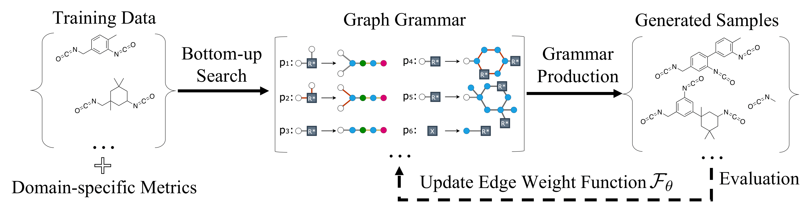

# Data-Efficient Graph Grammar Learning for Molecular Generation
This repository contains the implementation code for paper [Data-Efficient Graph Grammar Learning for Molecular Generation 
](https://openreview.net/forum?id=l4IHywGq6a) (__ICLR 2022 oral__).

In this work, we propose a data-efficient generative model (__DEG__) that can be learned from datasets with orders of
magnitude smaller sizes than common benchmarks. At the heart of this method is a learnable graph grammar that generates molecules from a sequence of production rules. Our learned graph grammar yields state-of-the-art results on generating high-quality molecules for
three monomer datasets that contain only ∼20 samples each.



## Installation

### Prerequisites
- __Retro*:__ The training of our DEG relies on [Retro*](https://github.com/binghong-ml/retro_star) to calculate the metric. Follow the instruction [here](#conda) to install.

- __Pretrained GNN:__ We use [this codebase](https://github.com/snap-stanford/pretrain-gnns) for the pretrained GNN used in our paper. The necessary code & pretrained models are built in the current repo.


### Conda
You can use ``conda`` to install the dependencies for DEG from the provided ``environment.yml`` file, which can give you the exact python environment we run the code for the paper:
```bash
git clone git@github.com:gmh14/data_efficient_grammar.git
cd data_efficient_grammar
conda env create -f environment.yml
conda activate DEG
pip install -e retro_star/packages/mlp_retrosyn
pip install -e retro_star/packages/rdchiral
```
>Note: it may take a decent amount of time to build necessary wheels using conda.

### Install ``Retro*``:
- Download and unzip the files from this [link](https://www.dropbox.com/s/ar9cupb18hv96gj/retro_data.zip?dl=0), 
and put all the folders (```dataset/```, ```one_step_model/``` and ```saved_models/```) under the ```retro_star``` directory.

- Install dependencies:
```bash
conda deactivate
conda env create -f retro_star/environment.yml
conda activate retro_star_env
pip install -e retro_star/packages/mlp_retrosyn
pip install -e retro_star/packages/rdchiral
pip install setproctitle
```


## Train

For Acrylates, Chain Extenders, and Isocyanates, 
```bash
conda activate DEG
python main.py --training_data=./datasets/**dataset_path**
```
where ``**dataset_path**`` can be ``acrylates.txt``, ``chain_extenders.txt``, or ``isocyanates.txt``.

For Polymer dataset,
```bash
conda activate DEG
python main.py --training_data=./datasets/polymers_117.txt --motif
```

Since ``Retro*`` is a major bottleneck of the training speed, we separate it from the main process, run multiple ``Retro*`` processes, and use file communication to evaluate the generated grammar during training. This is a compromise on the inefficiency of the built-in python multiprocessing package. We need to run the following command in another terminal window,
```bash
conda activate retro_star_env
bash retro_star_listener.sh
```

After finishing the training, to kill all the generated processes related to ``Retro*``, run
```bash
killall retron_star_listener
```


## Use DEG
Download and unzip the log & checkpoint files from this [link](https://drive.google.com/file/d/12g28WNAgRGzaLtuG6ESg25W-uzlNrpLQ/view?usp=sharing). See ``visualization.ipynb`` for more details.


## Acknowledgements
The implementation of DEG is partly based on [Molecular Optimization Using Molecular Hypergraph Grammar](https://github.com/ibm-research-tokyo/graph_grammar) and [Hierarchical Generation of Molecular Graphs using Structural Motifs
](https://github.com/wengong-jin/hgraph2graph).


## Citation
If you find the idea or code useful for your research, please cite [our paper](https://openreview.net/forum?id=l4IHywGq6a):
```bib
@inproceedings{guo2021data,
  title={Data-Efficient Graph Grammar Learning for Molecular Generation},
  author={Guo, Minghao and Thost, Veronika and Li, Beichen and Das, Payel and Chen, Jie and Matusik, Wojciech},
  booktitle={International Conference on Learning Representations},
  year={2021}
}
```


## Contact
Please contact guomh2014@gmail.com if you have any questions. Enjoy!